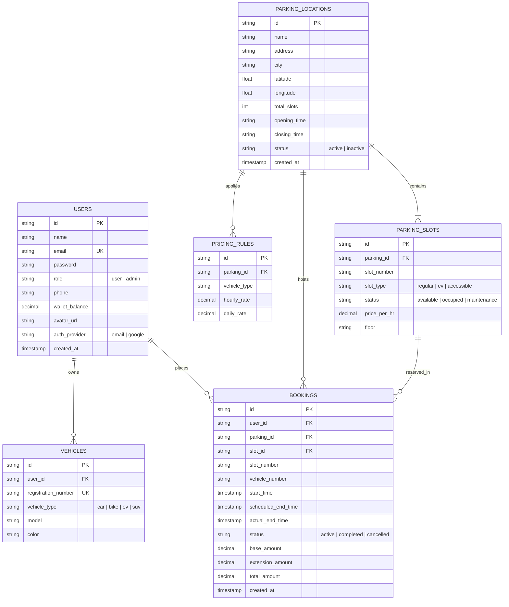

# 🗺️ ParkBy Database Entity-Relationship (ER) Diagram

This document contains the visual entity-relationship structure and table associations for the **ParkBy Smart Parking Management System**.

---

## 📊 Visual ER Diagram (Mermaid)

---

## 🔑 Database Indexes & Constraints

To ensure sub-millisecond query performance, the following indexes are declared:

1. **`idx_slots_parking`**: Index on `parking_slots(parking_id)` for instantly loading facility slots.
2. **`idx_slots_status`**: Index on `parking_slots(status)` for filtering available vs occupied slots.
3. **`idx_bookings_user`**: Index on `bookings(user_id)` for retrieving user booking history.
4. **`idx_bookings_status`**: Index on `bookings(status)` for active reservation monitoring.
